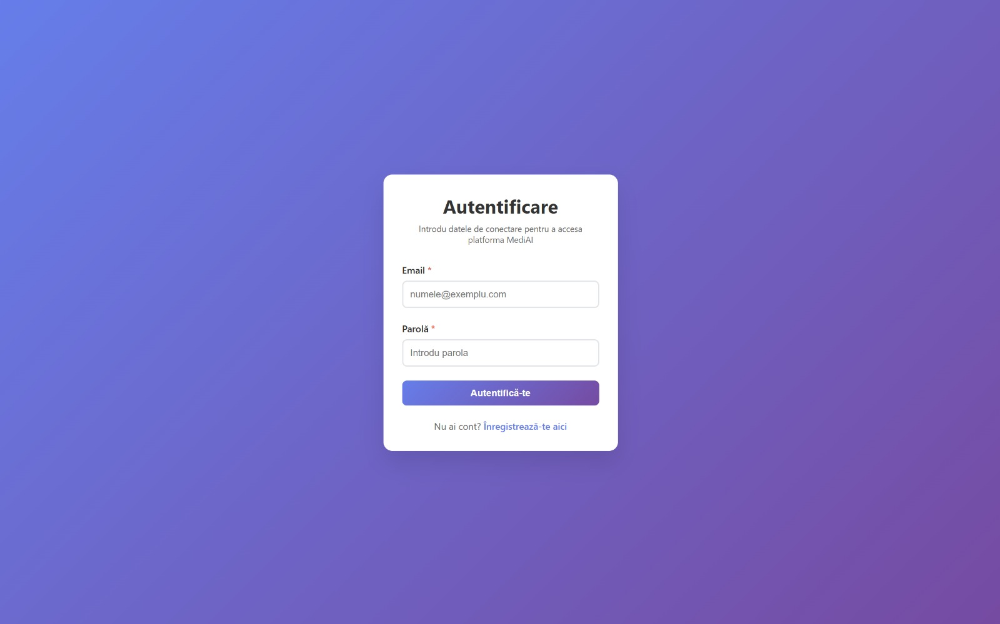
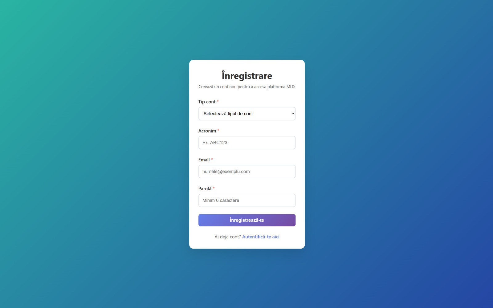
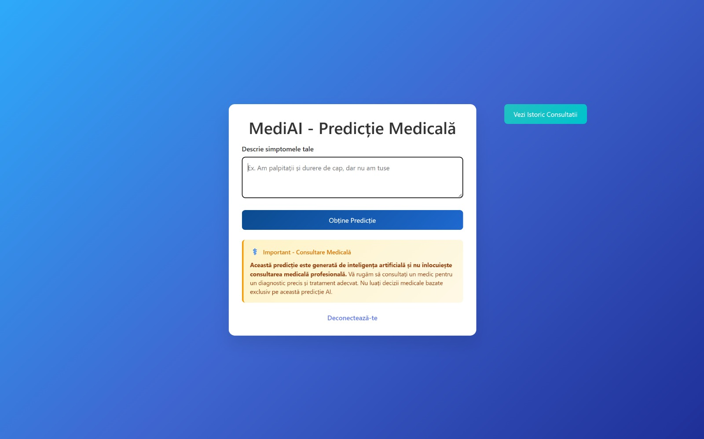
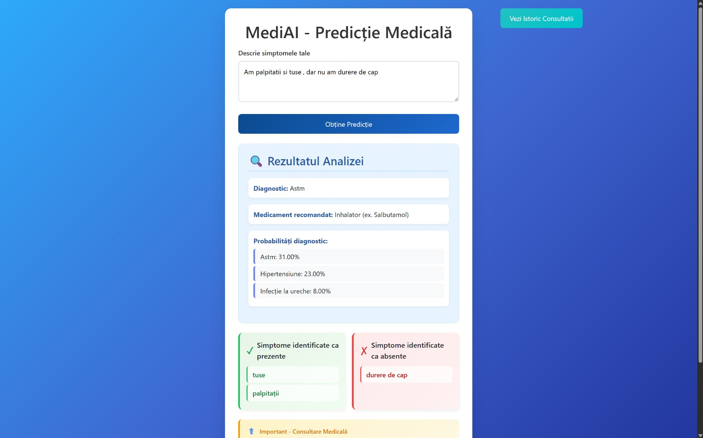
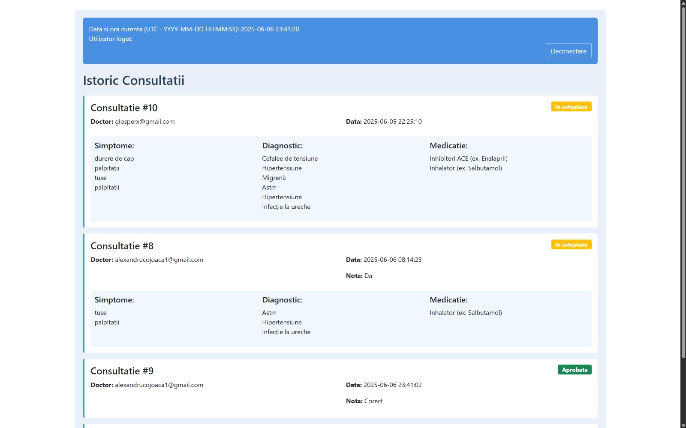
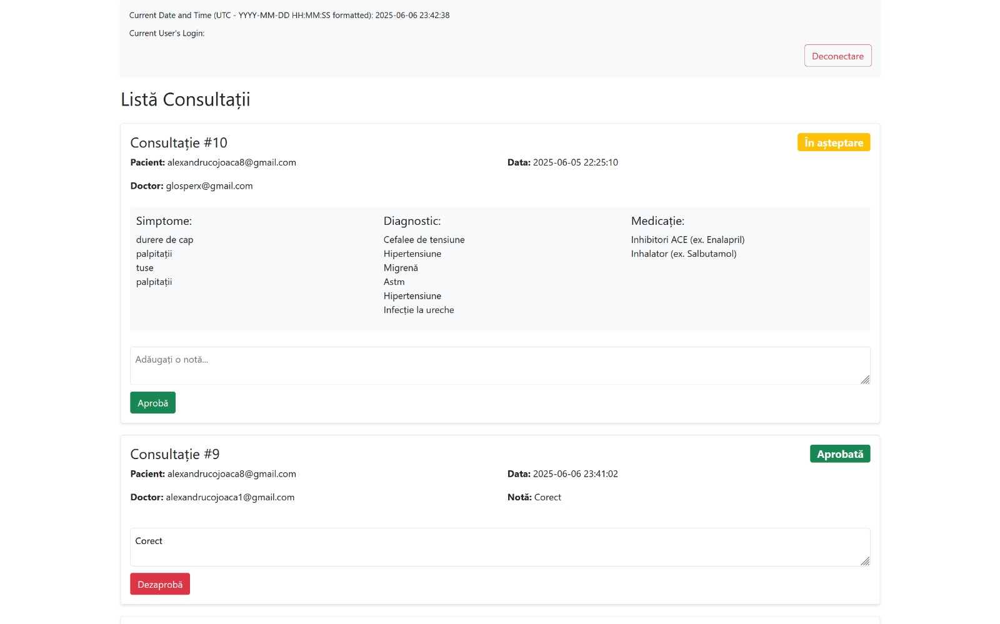
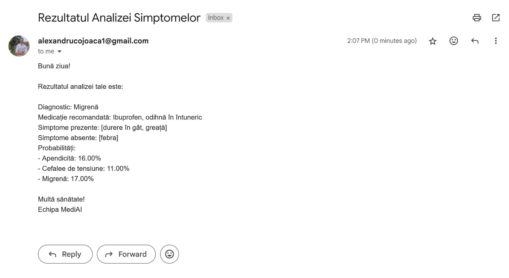
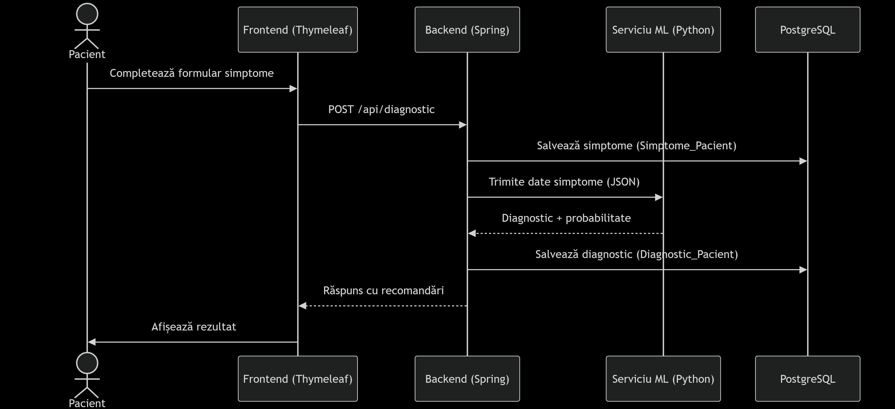
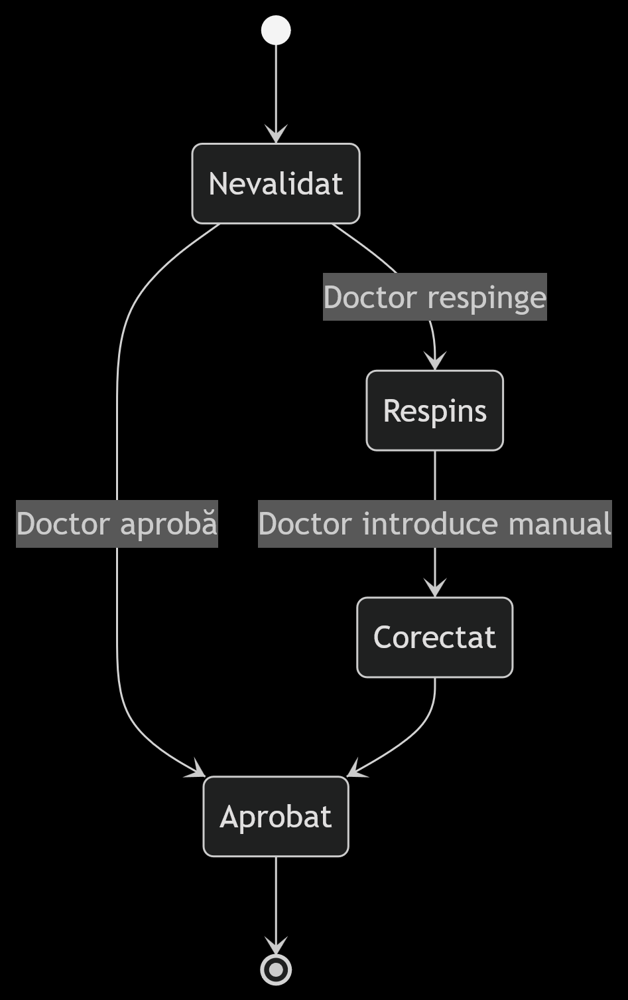

# Medical Decision Support System (MediAI)

A web-based platform designed to assist medical professionals and patients in the diagnostic process using Machine Learning (ML). The system suggests preliminary diagnoses based on patient-reported symptoms and medical history, enabling faster clinical decision-making.

## Table of Contents
- [Medical Decision Support System (MediAI)](#medical-decision-support-system-mediai)
  - [Table of Contents](#table-of-contents)
  - [Overview](#overview)
  - [Features](#features)
  - [Technologies](#technologies)
  - [Installation](#installation)
  - [Usage](#usage)
  - [Screenshots](#screenshots)
  - [Descriere în Română](#descriere-în-română)
  - [Diagrame](#diagrame)
  - [License](#license)

## Overview
The Medical Decision Support System (MediAI) is a web application that enhances the medical diagnostic process by using a Machine Learning (ML) model to analyze patient symptoms and provide preliminary diagnostic suggestions. The platform is designed for:
- **Patients**: To input symptoms in natural language and manage their medical history.
- **Doctors**: To validate ML-generated suggestions and create treatment plans.
- **Admin**: To manage user accounts and oversee consultations.


## Features
- **User Authentication and Authorization**:
  - Secure login with email and password using BCrypt encryption.
  - Role-based access control (Patient, Doctor, Admin) with RBAC.
  - Email verification with temporary tokens for account activation.
- **ML-Powered Diagnostics**:
  - Patients input symptoms in natural language, processed by a Random Forest ML model.
  - Generates reports with suggested diagnoses, probabilities, recommended medications, and identified/negated symptoms.
  - Reports are saved to the patient’s history and sent via email.
- **Consultation Management**:
  - Doctors can review, approve, or disapprove ML-generated reports and add notes.
  - Administrators can manage consultations and disapprove previously approved reports.
- **Patient History**:
  - Patients can view a chronological history of their consultations.
- **Responsive UI**:
  - Intuitive, mobile-friendly interface built with Bootstrap and Thymeleaf.
  - Accessible design with clear error messages.

## Technologies
- **Frontend**: Thymeleaf, Bootstrap
- **Backend**: Spring Boot
- **Database**: PostgreSQL
- **Machine Learning**: Python 3.11, scikit-learn (RandomForestClassifier), Flask
- **Security**: Spring Security, BCrypt, CSRF protection

## Installation
1. **Clone the Repository**:
   ```bash
   git clone https://github.com/glosperx/mediai.git
   cd mediai
   ```
2. **Set Up Backend**:
   - Ensure Java 17 and Maven are installed.
   - Configure `application.properties` in `src/main/resources` with your PostgreSQL credentials and SMTP settings for email notifications.
   - Build and run the Spring Boot application:
     ```bash
     mvn clean install
     mvn spring-boot:run
     ```
3. **Set Up Machine Learning Service**:
   - Ensure Python 3.11 and Flask are installed.
   - Install required Python libraries:
     ```bash
     pip install -r requirements.txt
     ```
   - Run the Flask server:
     ```bash
     python app.py
     ```
4. **Set Up Database**:
   - Install PostgreSQL 15 and create a database.
   - Run the SQL script in `MediAI/Data_Base/Script.sql` to set up the schema.
5. **Access the Application**:
   - Open `http://localhost:8080` in your browser.

## Usage
Upon accessing the platform, users are redirected to the login page (`/login`). If they don’t have an account, they can navigate to the registration page (`/register`) via a dedicated button.

1. **Registration**:
   - Users select their account type (Patient or Doctor), provide an acronym, email, and password (encrypted with BCrypt). Admin accounts cannot be created directly on the platform.
   - A confirmation email with a temporary token is sent to the user’s email. The token is stored in the database and deleted after account activation.
   - Users activate their account by clicking the email link.

2. **Login**:
   - After logging in with valid credentials, users are redirected based on their role:
     - **Patients**: Redirected to `/predict`.
     - **Doctors**: Redirected to `/consultations`.
     - **Admins**: Redirected to the consultation dashboard for management.

3. **Patients**:
   - At `/predict`, patients can input symptoms in free text (including negated symptoms, e.g., "no fever").
   - The ML model (Random Forest) processes the input and generates a report with:
     - Suggested diagnosis and its probability.
     - Recommended medications.
     - Identified and negated symptoms.
   - The report is saved to the patient’s history, displayed in the interface, and sent to the user’s email.
   - Patients can view their consultation history at `/patient_history`.
   - A logout button is available to end the session.

4. **Doctors**:
   - At `/consultations`, doctors can view all patient reports, including ML-generated diagnoses, medications, and symptoms.
   - Doctors can approve reports, adding optional textual notes.

5. **Admins**:
   - Admins can input symptoms for predictions (like patients) at `/predict`.
   - At `/consultations`, admins can view and manage all consultations, with the ability to disapprove previously approved reports.

## Screenshots
- Login page (`screenshots/login.png`)  
  
- Registration page (`screenshots/register.png`)  
  
- Patient dashboard for symptom input (`screenshots/predict1.png` and `screenshots/predict2.png`)  
  
  
- Doctor consultation dashboard (`screenshots/consultatii1.png` and `screenshots/consultatii2.png`)  
  
  
- Email with Results  
  
## Descriere în Română  
**Sistem de Asistență pentru Decizii Medicale (MediAI)** este o platformă web care utilizează inteligența artificială pentru a sugera diagnostice preliminare pe baza simptomelor introduse de pacienți. Aplicația facilitează comunicarea între pacienți și medici, oferind suport în procesul de diagnosticare și gestionare a consultațiilor.  

## Diagrame

**Diagrama secventiala**  
Fluxul complet de la raportarea simptomelor până la primirea diagnosticului  



**Diagrama de stare**  
Tranzițiile posibile pentru o consultație medicală  
Stările corespund câmpului aprobat din tabela Consultatie  


  
## License
This project is licensed under the MIT License - see the [LICENSE](LICENSE) file for details.